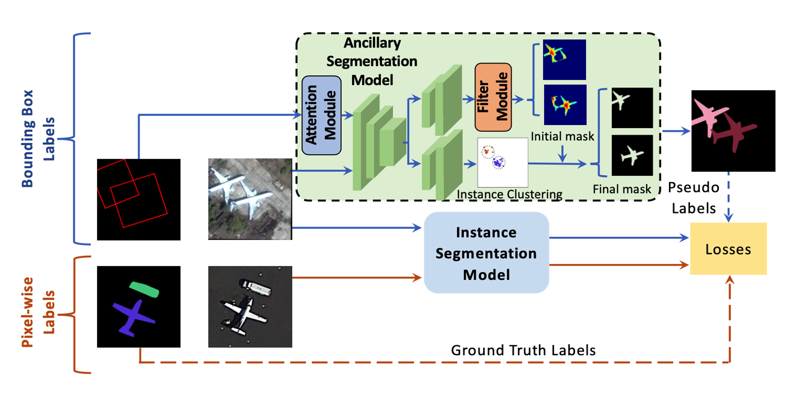

# Efficient-Hybrid-Supervision-for-Instance-Segmentation-in-Aerial-Images

	Linwei Chen, Ying Fu*, Shaodi You and Hongzhe Liu

------

[**Paper**](https://www.mdpi.com/2072-4292/13/2/252)

------

**Abstract**

Instance segmentation in aerial images is of great significance for remote sensing applications, and it is inherently more challenging because of cluttered background, extremely dense and small objects, and objects with arbitrary orientations. Besides, current mainstream CNN-based methods often suffer from the trade-off between labeling cost and performance. To address these problems, we present a pipeline of hybrid supervision. In the pipeline, we design an ancillary segmentation model with the bounding box attention module and bounding box filter module. It is able to generate accurate pseudo pixel-wise labels from real-world aerial images for training any instance segmentation models. Specifically, bounding box attention module can effectively suppress the noise in cluttered background and improve the capability of segmenting small objects. Bounding box filter module works as a filter which removes the false positives caused by cluttered background and densely distributed objects. Our ancillary segmentation model can locate object pixel-wisely instead of relying on horizontal bounding box prediction, which has better adaptability to arbitrary oriented objects. Furthermore, oriented bounding box labels are utilized for handling arbitrary oriented objects. Experiments on iSAID dataset show that the proposed method can achieve comparable performance (32.1 AP) to fully supervised methods (33.9 AP), which is obviously higher than weakly supervised setting (26.5 AP), when using only 10% pixel-wise labels.



## Citation

If you use our code for research, please ensure that you cite our paper:

Linwei Chen, Ying Fu, Shaodi You and Hongzhe Liu, "Efficient Hybrid Supervision for Instance Segmentation in Aerial Images", in Remote Sensing.

> ```
> @article{chen2021efficient,
>   title={Efficient Hybrid Supervision for Instance Segmentation in Aerial Images},
>   author={Chen, Linwei and Fu, Ying and You, Shaodi and Liu, Hongzhe},
>   journal={Remote Sensing},
>   volume={13},
>   number={2},
>   pages={252},
>   year={2021},
>   publisher={Multidisciplinary Digital Publishing Institute}
> }          
> ```


## Questions

If you have any questions, please email to chenlinwei@bit.edu.cn.